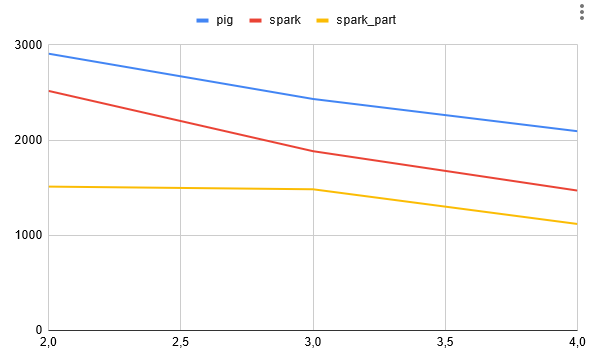

Projet Large Scale Data Management

The goal of the project is to run benchmarks regarding the execution time of the PageRank algorithm, while tinkering 
with the following parameters :

- Big Data frameworks (PIG, SPARK)

- Amount of workers

Contributors :

 - Bilal MOLLI

 - Erwan BOISTEAU-DESDEVISES

## EXPERIMENTS

We ran experiments with the following parameters :

| Page Rank Algorithm  |   | Execution time (ms)  |
|---------------------------|------------------|----------------------|
| Pig                       | 1                | 5 965 137            |
| Pig                       | 2                | 2 926 194            |
| Pig                       | 4                | 2 097 353            |
| Pig                       | 5                | 1 936 174            |
| Spark                     | 1                | FAILED               |
| Spark                     | 2                | 2 457 349            |
| Spark                     | 4                | 1 755 194            |
| Spark                     | 5                | 1 777 790            |
| Spark + Controlled Part.  | 1                | FAILED               |
| Spark + Controlled Part.  | 2                | 1 507 807            |
| Spark + Controlled Part.  | 4                | 1 504 586            |
| Spark + Controlled Part.  | 5                | 1 469 502            |

## RESULTS

